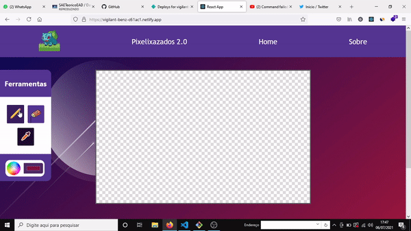

# Aplicação front-end de desenho para pixel-art

Visite aqui -> https://vigilant-benz-c61ac1.netlify.app/

* Tecnologias usadas, aperfeiçoadas e aprendidas: 

* ReactJS
* TypeScript
* Deploy com Netifly

